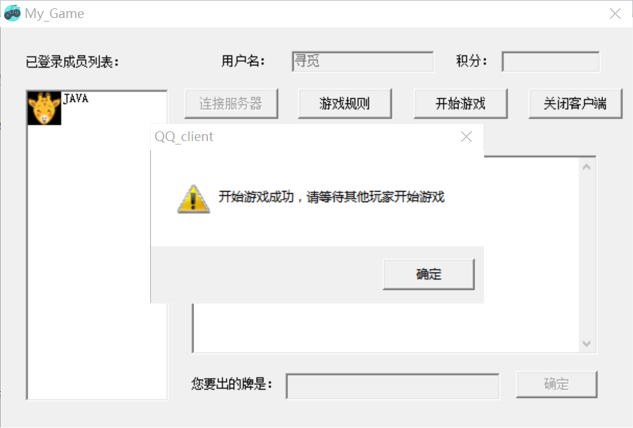

# Online-Cardgame-implemented-by-Winsock
基于 **Winsock** 实现的在线卡牌游戏（支持聊天室功能）

该项目是基于 **南京理工大学《网络编程》课程作业** 实现的, 非常感谢教学团队的指导！
## 1.简介

本软件——“My_Game卡牌游戏”是一款基于 **Winsock** 实现的在线卡牌游戏。其开发环境如下：

- 开发系统: Windows 10 
- 软件开发语言: C++
- 开发工具: Microsoft Visual C++ 6.0 
- GUI平台: *MFC*: 微软基础类库，以C++类的形式封装了Windows API，提供可视化界面。
- Winsock：Winsock是Windows下网络编程套接字的规范。

## 2. 参考资料

- 《软件工程导论——第5版》        张海藩 等编著    清华大学出版社
- 《Visual C++网络编程案例实战》    梁伟 等编著      清华大学出版社 

## 3. 程序界面

### 3.1 服务器端界面

### 3.2 客户端界面

## 4. 使用方法

本软件采用C/S模式，故需先使用并打开服务器端，才可以由用户在客户端进行操作。

### 4.1 服务器端操作

打开服务器端后点击“开启服务器”后即可开启服务器。点击“关闭服务器”按钮后即关闭程序。

开启成功会提示如下界面：

开启成功后即可从客户端使用本软件服务。

### 4.2 客户端操作

#### 4.2.1 客户端登录

用户在打开应用后，在红框内输入用户名后点击连接服务器。（注意，如果出现和其他用户相同的用户名则会提示用户需要重新输入）

如果用户名为空或重复会出现如下提示：

登陆成功，提示如下：

#### 4.2.2 聊天功能

如下图所示，双击左侧“寻觅”头像后跳出信息编辑框，编辑成功后点击“发送”按钮，即可发送成功，在目的端可以看到聊天信息。

#### 4.2.3 游戏功能

点击“游戏规则”按钮后会跳出如下提示对话框，该对话框显示游戏规则。

点击“开始游戏”按钮后跳出提示，等待所有登录成功的玩家都点击“开始游戏”后正式开始游戏。

正式开始游戏后的界面如下图。

游戏界面框内是玩家拥有的牌，玩家需要选择要出的牌进行输入，输入后点击“确定”。如果出牌为空或没有拥有此牌，则跳出提示如下。

如果玩家正确出牌后，出现提示：

等待所有玩家输入完成后，则进行下一步提示：

可见，服务器对于玩家出的牌进行了判断，并返回结果。

进行3小轮游戏后，积分信息出现在右上角。

#### 4.2.4 退出客户端

点击右上角“关闭客户端”即可退出程序。